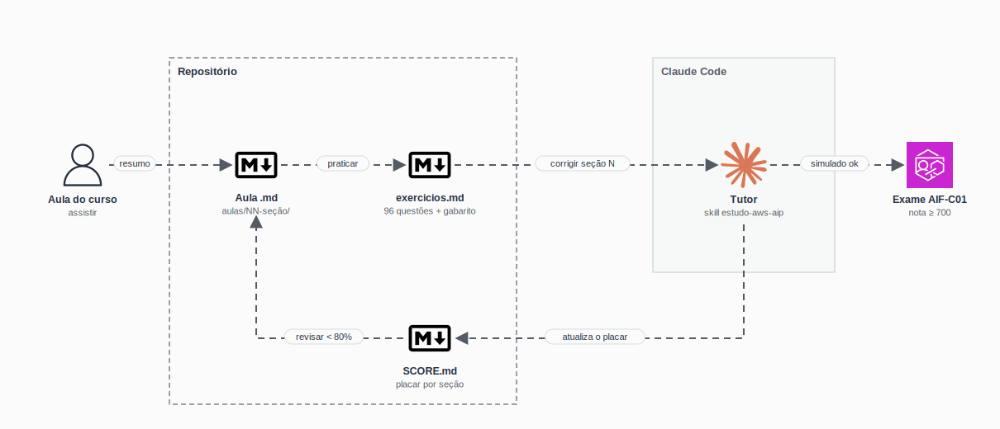

<h1 align="center">
  AWS Certified AI Practitioner · Plano de Estudos
</h1>

<p align="center">
  
</p>

<p align="center">
  <a href="https://skillicons.dev">
    
  </a>
</p>

## Qual a finalidade do projeto?

Plano de estudos completo para a certificação **AWS Certified AI Practitioner (AIF-C01)**, a certificação de IA e IA Generativa da AWS de nível *foundational*.

O material acompanha o curso **aula por aula**: cada aula vira um arquivo `.md` que condensa o que realmente cai na prova, e cada seção termina com **exercícios no estilo do exame**. Um **tutor no Claude Code** corrige as respostas, explica os erros e mantém o **placar por seção** no `SCORE.md`, mostrando o que precisa ser revisado antes da prova.

O ciclo de estudo é: **assistir → ler → exercitar → corrigir → revisar**.

## O que foi construído

### Sobre o exame

| Item | Valor |
|---|---|
| Código | AIF-C01 |
| Nível | Foundational |
| Questões | 65 (50 pontuadas + 15 experimentais) |
| Duração | 90 minutos |
| Nota de corte | **700** (escala de 100 a 1000) |
| Custo | US$ 100 |
| Validade | 3 anos |

### Domínios e pesos

| Domínio | Peso | Seções |
|---|---:|---|
| 1 · Fundamentos de IA e ML | 20% | 03, 07 |
| 2 · Fundamentos de IA Generativa | 24% | 04, 05 |
| 3 · Aplicações de Foundation Models | **28%** | 05, 06, 08 |
| 4 · Diretrizes de IA Responsável | 14% | 09 |
| 5 · Segurança, Conformidade e Governança | 14% | 09, 10 |

> Os domínios 2 e 3 somam **52%** da prova: as seções 04, 05, 06 e 08 merecem a maior parte do tempo.

### Seções

| # | Seção | Aulas |
|---|---|---|
| 01 | [Iniciando](aulas/01-iniciando) | 2 |
| 02 | [A AWS](aulas/02-a-aws) | 3 |
| 03 | [IA: Inteligência Artificial](aulas/03-ai-inteligencia-artificial) | 4 |
| 04 | [Engenharia de Prompt](aulas/04-engenharia-de-prompt) | 4 |
| 05 | [Amazon Bedrock](aulas/05-amazon-bedrock) | 12 |
| 06 | [Amazon Q](aulas/06-amazon-q) | 7 |
| 07 | [SageMaker](aulas/07-sagemaker) | 1 |
| 08 | [Serviços de IA na AWS](aulas/08-servicos-de-ia-na-aws) | 14 |
| 09 | [Práticas e Responsabilidades de IA](aulas/09-praticas-e-responsabilidades-de-ia) | 5 |
| 10 | [Segurança](aulas/10-seguranca) | 2 |
| 11 | [O Exame](aulas/11-o-exame) | 1 |
| 12 | [Finalizando](aulas/12-finalizando) | 1 |
| 13 | [Bônus](aulas/13-bonus) | 1 |

**57 aulas** e **96 questões**. Toda aula segue o mesmo modelo: 📌 resumo, 🎓 pontos-chave para a prova, 🔑 termos importantes, 💡 exemplo prático e ✅ checklist de domínio.

### Tutor no Claude Code

A skill [`estudo-aws-aip`](.claude/skills/estudo-aws-aip/SKILL.md) transforma o Claude Code num tutor da certificação:

| Comando | O que faz |
|---|---|
| `estudar <tópico/seção>` | Resume o material e faz uma pergunta de fixação |
| `corrigir seção <N>` | Corrige os exercícios, explica os erros e atualiza o `SCORE.md` |
| `meu progresso` | Analisa o `SCORE.md` e sugere o que revisar |
| `simulado` | Monta um simulado de 20 questões misturando seções |

## Tecnologias utilizadas

- **AWS:** Amazon Bedrock, Amazon Q, SageMaker e os serviços de IA (Comprehend, Translate, Transcribe, Polly, Rekognition, Lex, Textract, Kendra e outros);
- **Markdown:** aulas, exercícios e placar versionados no repositório;
- **Claude Code:** tutor com skill de projeto para estudar, corrigir e montar simulados.

## Estrutura do repositório

```text
studies-cert-aws-ai-practitioner/
├── aulas/
│   ├── 01-iniciando/            # NN-titulo.md (uma aula por arquivo) + exercicios.md
│   ├── ...
│   └── 13-bonus/
├── .claude/skills/estudo-aws-aip/
│   └── SKILL.md                 # Tutor no Claude Code
├── docs/study-flow.gif          # Fluxo de estudo
├── SCORE.md                     # Placar por seção
└── README.md
```

## Fluxo de funcionamento

1. **Assista** à aula do curso.
2. **Leia** o `.md` da aula em `aulas/`: ele condensa o que cai na prova.
3. **Marque** o checklist de domínio. Se não conseguir dar um caso de uso real, releia.
4. Ao fim da seção, abra o `exercicios.md` e preencha o bloco **"Minhas respostas"** (ex.: `1-B, 2-C, 3-A`). O gabarito fica recolhido no final, para não estragar o teste.
5. Peça `corrigir seção <N>` no Claude Code: o tutor compara com o gabarito, explica cada erro e atualiza o `SCORE.md`.
6. Revise as seções 🔴 (<60%) e 🟡 (60–79%) até todas ficarem 🟢 (≥80%), faça um `simulado` e marque a prova.

## Como validar a entrega

Em uma validação do plano, todas as seções devem estar no placar e o tutor deve conseguir corrigir e registrar o desempenho.

Pontos principais de validação:

- 13 seções em `aulas/`, cada uma com as aulas e o `exercicios.md`;
- `corrigir seção 1` atualizando o `SCORE.md` com acertos, porcentagem e status;
- `meu progresso` apontando as seções a revisar;
- `simulado` gerando 20 questões de seções variadas;
- todas as seções 🟢 (≥80%) antes da prova.

## Avisos de custo

Os laboratórios usam serviços **pagos**. Antes de começar:

- **Crie um orçamento no AWS Budgets** com alerta por e-mail (ex.: US$ 10).
- **O Amazon Bedrock não está no Free Tier**: cobra por token desde a primeira chamada.
- **Sempre remova os recursos** ao final de cada laboratório.

| Recurso que cobra mesmo ocioso | Cobrança |
|---|---|
| Amazon Q Business | Assinatura por usuário/mês |
| Amazon Kendra | Por hora de índice provisionado |
| OpenSearch Serverless (Knowledge Bases) | Por OCU |
| Endpoints real-time do SageMaker | Por hora, enquanto existirem |

## Referências oficiais

- [Página do exame AIF-C01](https://aws.amazon.com/certification/certified-ai-practitioner/)
- [Exam Guide (PDF)](https://d1.awsstatic.com/onedam/marketing-channels/website/aws/en_US/certification/approved/pdfs/docs-ai-practitioner/AWS-Certified-AI-Practitioner_Exam-Guide.pdf)
- [AWS Skill Builder](https://explore.skillbuilder.aws/)
- [AI Service Cards](https://aws.amazon.com/machine-learning/responsible-ai/resources/)

## Autor

**William Alves Coelho** · [@willtechdev](https://github.com/willtechdev)
